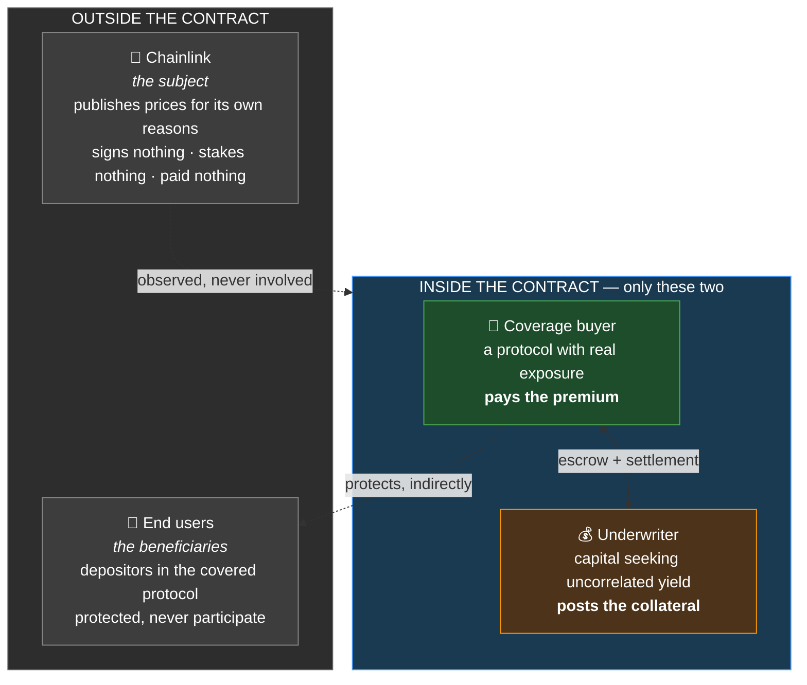
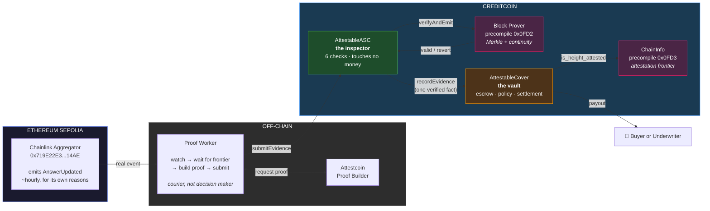
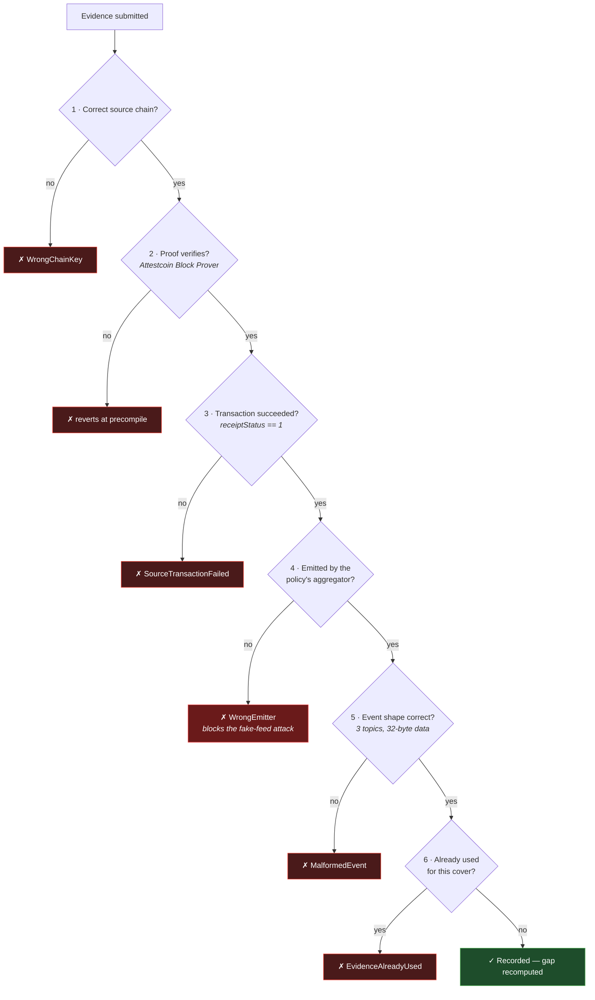
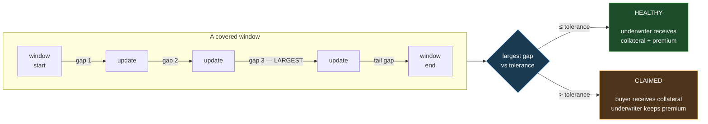
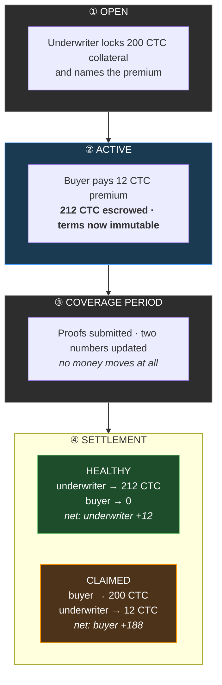

# Attestable

**Parametric coverage for blockchain infrastructure failure, settled by cryptographic proof instead of by a claims process.**

Built for **BUIDL CTC 2026 Fall** · Creditcoin + Attestcoin Protocol

---

> A protocol that depends on a price feed cannot stop that feed from going quiet. It can only detect it — and detection does not prevent loss. Attestable lets that risk be transferred to someone willing to carry it, and settles the outcome from evidence that neither party can fabricate, withhold, or dispute.

---

## Table of contents

- [The problem, measured](#the-problem-measured)
- [What Attestable is](#what-attestable-is)
- [Live on Creditcoin testnet](#live-on-creditcoin-testnet)
- [How it works](#how-it-works) ← **the architecture, in depth**
- [Why Attestcoin is load-bearing](#why-attestcoin-is-load-bearing)
- [Why settlement happens on Creditcoin](#why-settlement-happens-on-creditcoin)
- [Use cases](#use-cases)
- [Security model](#security-model)
- [Trust boundary](#trust-boundary)
- [Running it yourself](#running-it-yourself)
- [Testing](#testing)
- [Repository layout](#repository-layout)
- [Roadmap](#roadmap)
- [Known limitations](#known-limitations)

---

## The problem, measured

Chainlink's ETH/USD feed on Ethereum publishes a new price roughly once an hour. A large amount of DeFi depends on that number being fresh.

**On 31 August 2026, that feed went silent for 12 hours and 53 minutes.**

We did not read that in a post-mortem. We measured it ourselves, then re-measured it with error-suppression removed to make sure it wasn't an artifact of our own tooling — zero failed queries, and Ethereum was producing blocks throughout. The feed simply stopped publishing.

| Gap | From | To |
|---|---|---|
| 215 min | 2026-08-30 21:02 UTC | 2026-08-31 00:37 UTC |
| **773.6 min** | 2026-08-31 00:37 UTC | 2026-08-31 13:30 UTC |
| 667 min | 2026-08-31 13:30 UTC | 2026-09-01 00:37 UTC |

### Why "just check the timestamp" does not solve this

Every competent protocol already validates feed freshness. Chainlink's own documentation tells you to. So consider what happens to a **correctly built** lending market during those 12.9 hours:

Its staleness check fires. It refuses to price collateral. Liquidations halt. Positions drift underwater while the market moves, and bad debt accumulates that nobody can bill to anyone.

**The protocol did everything right and lost money anyway — precisely because it correctly refused to act on bad data.**

A fire alarm does not extinguish a fire. Detection, prevention, and compensation are three different problems. Engineering solves the first two. The third needs a counterparty.

And there is no counterparty today: Chainlink owes no individual protocol anything. There is no SLA, no recourse, and no instrument to transfer the exposure. It sits uninsured on every dependent balance sheet.

---

## What Attestable is

A **coverage buyer** — a protocol with real exposure — pays a premium.
An **underwriter** posts collateral and takes the other side.
A contract on **Creditcoin** decides the outcome, and refuses to take anyone's word for anything.

If the feed keeps its heartbeat, the underwriter keeps the premium and their collateral. If it goes quiet beyond the agreed tolerance, the collateral moves to the buyer. No claim is filed. No assessor votes. No administrator approves.

**Chainlink is not a party to any of this.** They sign nothing, stake nothing, receive nothing, and need not know Attestable exists. They are the *subject* of the contract, the way weather is the subject of a rainfall derivative. Attestable does not enforce an SLA and has no standing to.

Because neither counterparty can influence whether the feed publishes, the risk is genuinely **insurable rather than gameable** — and unusually, both sides can inspect the identical, complete, public history before pricing it.

---

## Live on Creditcoin testnet

Everything below is real and independently verifiable.

| Contract | Address |
|---|---|
| `AttestableCover` | [`0x87553eA864e4cd16357Fa3D0D27F9F4e831aDc91`](https://creditcoin-testnet.blockscout.com/address/0x87553eA864e4cd16357Fa3D0D27F9F4e831aDc91) |
| `AttestableASC` | [`0x3b531F270eec0F15816577FC0E556eAFf00B9Fe2`](https://creditcoin-testnet.blockscout.com/address/0x3b531F270eec0F15816577FC0E556eAFf00B9Fe2) |
| `EvmV1Decoder` (library) | [`0x843e8432dfE39e2010511796e7e37fC44EAb72d3`](https://creditcoin-testnet.blockscout.com/address/0x843e8432dfE39e2010511796e7e37fC44EAb72d3) |
| `SpikeVerifier` (feasibility gate) | [`0x38817EdCa801DeeC79Dbe586Af26a1D04D180248`](https://creditcoin-testnet.blockscout.com/address/0x38817EdCa801DeeC79Dbe586Af26a1D04D180248) |

**The proof that the pipeline works end to end:**

[`0x7c738788da8d94543739b7a8797f43b7c9394ad663d51693e2bba5cbd713d4a1`](https://creditcoin-testnet.blockscout.com/tx/0x7c738788da8d94543739b7a8797f43b7c9394ad663d51693e2bba5cbd713d4a1)

That transaction took a genuine Chainlink price publication from Ethereum Sepolia, verified it through Attestcoin's Block Prover precompile inside a Creditcoin contract, and changed on-chain state as a result. Gas used: 363,468. Decoded payload: **$2390.75**, round 35735, timestamped 2026-09-02 17:49 UTC.

**Two covers have settled, with opposite outcomes, on the same contract and the same pipeline:**

| | Cover #1 — HEALTHY | Cover #2 — CLAIMED |
|---|---|---|
| Window | 2026-09-11, 5.9 h | 2026-08-31, the real outage |
| Worst silence proven | **61.6 min** | **773.6 min** |
| Tolerance | 90 min | 90 min |
| Verified proofs submitted | 7 | 2 |
| Buyer receives | — | **200 CTC** |
| Underwriter receives | **212 CTC** | 12 CTC |
| Settlement | [`0x801da47a…`](https://creditcoin-testnet.blockscout.com/tx/0x801da47a335bb11898d78c5fdc49b04e8af19ba75248017c7c0ab2ab2bd253aa) | [`0xdf52e5ad…`](https://creditcoin-testnet.blockscout.com/tx/0xdf52e5adbb2ba5677225f4514981989f5730482cccc2fa11420c0ec5613f28cd) |

Note the healthy cover's worst gap: **61.6 minutes**. The feed's nominal heartbeat is 60. A policy written to the specification would have paid a claim against a perfectly functioning feed — which is why the tolerance is 90.

---

## How it works

### 1. The four actors, and which two are actually in the contract

This distinction is the most misunderstood part of the design, so it comes first.



**Money moves along exactly one axis: buyer ↔ underwriter.** Not one wei ever flows to or from Chainlink or an end user, in either direction.

### 2. The end-to-end pipeline



### 3. The life of a single piece of evidence

```mermaid
sequenceDiagram
    participant CL as Chainlink Aggregator
    participant W as Proof Worker
    participant CI as ChainInfo 0x0FD3
    participant PB as Proof Builder
    participant ASC as AttestableASC
    participant BP as Block Prover 0x0FD2
    participant COV as AttestableCover

    CL->>CL: publishes price<br/>emits AnswerUpdated
    W->>CL: observes event in policy window
    Note over W,CI: cannot prove a block until it is attested
    W->>CI: has the frontier reached this height?
    CI-->>W: not yet — wait
    Note over W: ~7.2 min measured lag
    CI-->>W: attested ✓
    W->>PB: build proof for this transaction
    PB-->>W: Merkle proof (7 siblings)<br/>+ continuity proof (65 roots)
    W->>ASC: submitEvidence(coverId, proof)

    rect rgb(30,77,43)
        ASC->>ASC: 1 · chain key matches policy
        ASC->>BP: 2 · verify inclusion + continuity
        BP-->>ASC: valid (or REVERTS)
        ASC->>ASC: 3 · receipt status == 1
        ASC->>ASC: 4 · emitter == policy aggregator
        ASC->>ASC: 5 · topics == 3, data == 32 bytes
        ASC->>ASC: 6 · read updatedAt from log data
    end

    ASC->>COV: recordEvidence(coverId, queryId, updatedAt)
    COV->>COV: replay check, window check, order check
    COV->>COV: gap = updatedAt − lastTimestamp<br/>maxGap = max(maxGap, gap)
    Note over COV: two numbers updated. O(1). No arrays.
```



### 4. The six checks — and why each exists

Cryptography proves that something **happened**. It cannot prove the something was **meaningful**. Anyone can deploy a contract emitting a fabricated price and obtain a perfectly genuine proof of it. Checks 3–5 are what separate a valid proof from useful evidence.



**Check 3 exists because the precompile proves inclusion, not success.** A reverted transaction is still genuinely inside its block.

**Check 4 is the one that matters most.** It blocks an attack no cryptography can catch: deploy a lookalike contract, emit an identically-shaped event carrying an invented price, prove it honestly. *The proof is real; the evidence is worthless.* **We tested this against the live precompile on Creditcoin and it was rejected.**

**Check 5 is load-bearing in a way that is easy to miss.** A Solidity event signature hashes parameter *types only* — indexing does not change it. Our first implementation assumed one indexed parameter; the real event has two. `topic0` matched perfectly against the wrong assumption, and the decoder would have read the price from the wrong slot **while every signature check passed**. Only decoding raw bytes by hand caught it.

### 5. How settlement is decided

The policy is *"no silence between updates may exceed the tolerance."* Evaluating that naively means storing every timestamp and sorting at settlement — unbounded cost.

Instead, evidence arrives in chronological order and the contract keeps **two numbers**.



Each submission is two comparisons. Cost does not grow with the number of updates.

**This design has a deliberate consequence:** skipping evidence makes the apparent gap *larger*, pushing toward `CLAIMED`. That is correct — missing evidence genuinely cannot prove there was no outage — and it is incentive-compatible, because the underwriter profits from `HEALTHY` and is therefore the party motivated to submit everything. Submission is permissionless, so nobody can suppress evidence to manufacture a claim either.

### 6. Where the money actually goes



Money in equals money out on both branches — proven by a 256-run fuzz test.

**Critically: Attestable does not recover the underlying loss.** The lending protocol's bad debt still happens, in its own protocol, on its own chain. What Attestable does is hand over compensation from a pot funded in advance. Insurance never un-burns the house.

---

## Why Attestcoin is load-bearing

Without it, a Creditcoin contract has no way to know what happened on Ethereum. It would have to trust an oracle, an indexer, an API, or our own backend — every one of which is exactly the discretionary trust this product exists to eliminate.

**Attestable uses both Attestcoin surfaces, for different jobs:**

| Precompile | Question it answers | Where we use it |
|---|---|---|
| **Block Prover** `0x0FD2` | *Did this genuinely happen?* | Every piece of evidence, via `verifyAndEmit` — Merkle inclusion plus continuity to an attested block |
| **ChainInfo** `0x0FD3` | *Could evidence have been supplied by now?* | Settlement gate — a cover cannot finalize until the attestation frontier passes the window |

That second one is subtle and matters. Attestcoin proves *inclusion*; it can never prove *absence*. So Attestable never claims to have proven a feed went quiet. Its finding is narrower and honest:

> **Insufficient valid evidence was submitted before an attestation-safe deadline.**

Without the frontier gate, a slow attestor set alone could trigger a payout — we would be paying out on our own infrastructure lag and calling it an outage.

**What we measured about the protocol itself** (all verified, not quoted from docs):

| | |
|---|---|
| Attestation lag | ~7.2 min (36 blocks) on Sepolia; ~7.6 min on mainnet |
| Provable history | **the entire chain, back to block 1** — verified by probing continuity bounds at 1h, 1d, 1w, 1mo, 6mo, 1y, and genesis+1 |
| Gas per proof | 363,468 actual, against a 366,000 predicted — the reference formula is accurate |
| Batch proofs | `getBatchProof` returns **one** continuity proof for many Merkle proofs — since the 65 continuity roots dominate cost, this is what makes proving every update affordable |

That last finding decided our policy design. We chose max-interval semantics — the *correct* way to measure staleness — over cheaper bucket-counting, because batching removed the cost objection.

---

## Why settlement happens on Creditcoin

The policy engine evaluates conditions spanning **multiple external chains**. Ethereum cannot natively verify state from another chain. Creditcoin can, through Attestcoin.

Creditcoin is therefore the only place a contract of this shape *can* settle — and each cover written brings two funded participants who otherwise had no reason to transact there, generates recurring proof-submission transactions for the cover's whole life, and locks escrow on-chain throughout.

---

## Use cases

### Who buys coverage

All share one shape: **their economics break when a dependency they do not control goes quiet, and no engineering on their side prevents it.**

| Buyer | The failure mode | What coverage achieves |
|---|---|---|
| **Lending protocols** | Staleness check halts liquidations; positions drift underwater; bad debt accrues | An unbounded tail risk becomes a budgetable monthly cost. A risk committee can finally attach a *number* to "we depend on an oracle" |
| **Perps / derivatives venues** | Stale mark price and funding rates bleed continuously to arbitrage | Converts silent, continuous leakage into a hedged, priced exposure |
| **Collateralized stablecoins** | Stale collateral valuation forces under-collateralized issuance or a frozen mint/redeem cycle | Protects the peg — which *is* the product — through an outage |
| **Vaults, structured products, RWA platforms** | Rebalancing and mark-to-market stop when the feed stops | Continuity capital during degraded periods |

### Who underwrites

| Underwriter | Why they take the other side |
|---|---|
| **DeFi funds / yield desks** | Nearly all DeFi yield is *beta* — it evaporates when markets fall. Feed liveness is **uncorrelated with market direction**, which is genuinely scarce. And the entire update history is public and free, so the risk is modelable rather than guessed |
| **Market makers / vol desks** | Already price tail events professionally. A familiar instrument shape with unusually clean data |
| **The infrastructure operator itself** | The most interesting case — see below |

### The operator-underwriting angle

A newer oracle network competing for business against an incumbent has a credibility problem: marketing claims do not move procurement teams.

So instead of *saying* they are reliable, **they underwrite coverage on their own feed.** "We will pay you if we go stale" is a financial commitment backed by their own capital, not a slogan.

This is also the cleanest answer to the obvious objection — *"why not just let the provider fix it?"* Underwriting is **how a provider proves they fixed it.** Attestable hands infrastructure operators a procurement weapon.

### Where end users sit

Mostly invisible, and that is correct. A depositor in a covered protocol is safer without knowing, the way a bank customer inherits reinsurance they never bought. Expect it to surface as a line in a risk disclosure: *"oracle-liveness risk: covered to 200,000 CTC."*

### Beyond price feeds

The evidence source is stored as **policy data, not hardcoded**. Extending is a matter of parameters, not rewrites:

| Extension | What changes |
|---|---|
| Any other Chainlink feed — BTC/USD, gold, FX | **Nothing.** Pass a different aggregator address |
| Any contract emitting a similar event | Nothing — the event signature is a policy field |
| Bridge delivery, keeper execution, sequencer liveness | A decoder for that event's layout. Verification, escrow and settlement are untouched |
| Additional source chains | Requires Attestcoin support — Ethereum mainnet is already live as chain key 3 |

---

## Security model

Tested against the **live** precompile on Creditcoin, not in simulation. Five attacks, all rejected, with the accepted-evidence counter unchanged throughout:

| Attack | Rejected with |
|---|---|
| Replay identical evidence | `AlreadyConsumed` |
| Relabel Sepolia proof as mainnet | `WrongChainKey(1, 3)` |
| Flip one byte of the Merkle root | precompile: `Merkle proof validation failed` |
| Alter the proven transaction payload | precompile: `Merkle proof validation failed` |
| **Valid proof, wrong aggregator** | `WrongEmitter` |

Plus 48 local tests covering both settlement branches, the real 12.9-hour outage replayed, the measured 61.4-minute worst case correctly *not* claiming, per-cover replay, cross-cover evidence reuse, ordering, window bounds, the frontier gate, double settlement, and a 256-run fuzz on escrow conservation.

### A design decision worth calling out

**Replay protection is scoped per cover, never globally.** One Chainlink update is legitimately valid evidence for *every* cover written against that feed and window — those are independent contracts. Consuming a query globally would let the first cover starve all others. This deliberately diverges from the loan-style pattern in Creditcoin's reference examples, where global consumption is correct.

### Tolerance must exceed the measured worst case

The feed's nominal heartbeat is 3600 seconds. Its **real** worst-case gap on a perfectly healthy day is **61.4 minutes**, because the heartbeat fires after 3600s *plus* block time.

**A 60-minute tolerance would register violations against a functioning feed.** We use 90 minutes. This single measurement is the difference between a viable product and one that pays claims on healthy infrastructure.

---

## Trust boundary

Most projects claim to be trustless. Being precise about where trust actually remains is more useful — and more defensible.

**Verified cryptographically**

- Source-chain identity and source block
- Transaction inclusion (Merkle) and chain descent (continuity)
- Transaction success — checked explicitly, since the precompile does not
- Event emitter address and event signature
- Event data required by the policy
- Evidence falls inside the coverage window
- Evidence not already counted for this cover
- Attestation state at settlement time

**Explicitly not claimed**

- That Chainlink has entered any agreement with this project
- That the feed's reported *price* is truthful — we cover silence, never inaccuracy
- That absence of an event has been proven
- That Attestcoin removes all trust assumptions
- That this prototype is a regulated insurance product

---

## Running it yourself

### Prerequisites

- Node.js 20+ and npm
- [Foundry](https://getfoundry.sh/)
- An **archive-capable** Ethereum Sepolia RPC (Alchemy or Infura free tier). Public endpoints only serve recent logs and will silently return nothing for historical windows
- tCTC from the [Creditcoin Discord faucet](https://discord.gg/Gu43zTfmtc)

### Setup

```bash
git clone https://github.com/Nailer/attestable.git
cd attestable
npm install
cp .env.example .env      # then fill in RPC URLs and keys
```

### Verify the environment before building anything

```bash
npx tsx spike/check-creditcoin.ts   # chain ID, precompiles, provable window
npx tsx spike/check-chainlink.ts    # resolve the aggregator, confirm the event
```

### Build and test

```bash
forge build
forge test                          # 30 tests
```

### Create and fill a cover

```bash
npx tsx worker/create-cover.ts outage    # underwriter + buyer fund a real cover
npx tsx worker/relayer.ts <coverId>      # worker proves and submits evidence
```

---

## Testing

```bash
forge test -vv
```

| Suite | Covers |
|---|---|
| `AttestableASC.t.sol` | Decoding **real chain bytes**, wrong emitter, absent signature, wrong chain key, failed verification, inactive cover, and full ASC→Cover integration |
| `AttestableCover.t.sol` | Escrow, both settlement branches, the real outage replayed, the measured worst case, replay, ordering, window bounds, frontier gate, fuzz conservation |

The ASC tests run against the **actual 3,168 bytes** of encoded transaction and receipt from Sepolia tx `0x797c7f9b…` — the same evidence that passed the feasibility gate. A synthetic fixture would only prove we can parse our own assumptions back out again.

---

## Repository layout

```
contracts/
  AttestableASC.sol          the inspector — verification only, touches no money
  AttestableCover.sol        the vault — escrow, policy, settlement
  AttestableTypes.sol        shared structs; policy is DATA, not hardcoded
  interfaces/
    INativeQueryVerifier.sol Block Prover 0x0FD2
    IChainInfo.sol           ChainInfo 0x0FD3
  spike/SpikeVerifier.sol    feasibility gate contract
worker/
  relayer.ts                 proof courier — watch, wait, prove, submit
  create-cover.ts            underwriter and buyer fund a cover
  scenarios.ts               coverage windows derived from real history
spike/
  REPORT.md                  full investigation log, findings and mistakes
  *.ts                       reproducible verification scripts
test/                        30 tests, real-data fixtures
SPEC.md                      frozen architecture
TASKS.md                     every build step and its verification
```

---

## Roadmap

**Now** — Chainlink feed liveness on Ethereum Sepolia, single chain.

**Next** — multi-chain policies combining evidence from several source chains in one contract, which is the strongest expression of why settlement belongs on Creditcoin.

**Then** — bridge delivery guarantees, keeper execution, sequencer liveness, cross-chain messaging. All the same engine with a different decoder.

**The real next milestone is not technical.** It is one design partner — most plausibly a mid-sized lending protocol that has already been burned by oracle latency and remembers it.

---

## Known limitations

Stated plainly, because a project that hides these is worse than one that names them.

**Multi-chain is not demonstrated.** Ethereum mainnet (chain key 3) is actively attested and we confirmed the aggregator resolves — but no RPC available to us permits the historical log queries needed to locate a candidate transaction. That is our infrastructure limit, not a protocol limit. We cut it rather than ship a half-working feature.

**Demand is unproven.** The risk is real and measured, the loss mechanism is concrete, but nobody is meaningfully hedging oracle-staleness risk today and there are no signed customers. This instrument does not yet exist.

**A misconfigured policy cannot be caught at runtime.** A single Chainlink update emits three events, and `NewRound` has the *same shape* as `AnswerUpdated` — three topics, one data word. So the shape assertion cannot detect a wrong event signature. The defence is reading the policy before purchase, which is possible because policy terms are immutable and public once a cover is active.

**Historical evidence needs an archive RPC.** Free public endpoints serve roughly the last 10,000 blocks. Older windows require a paid or keyed provider.

**The `status == 1` rejection path is not covered by a test.** The check is in the code and reviewable, but testing it needs a *proven failed transaction*, which we do not have. Named here rather than left for someone to discover.

---

## License

MIT
